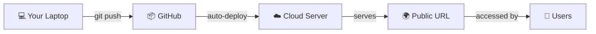
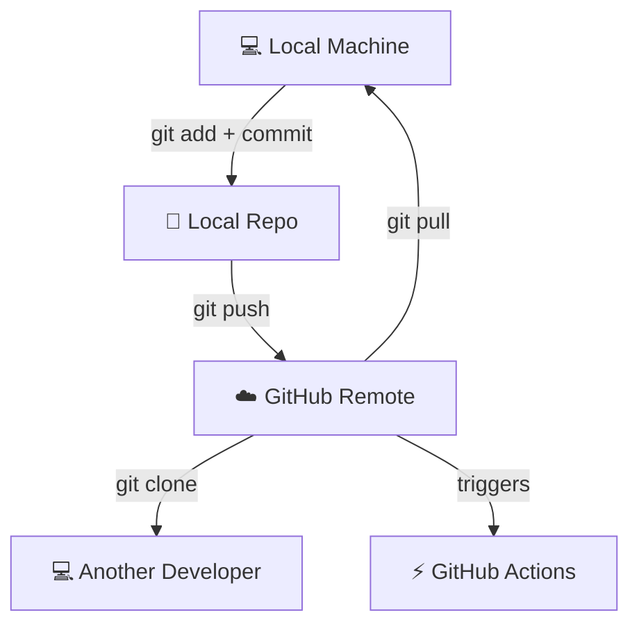
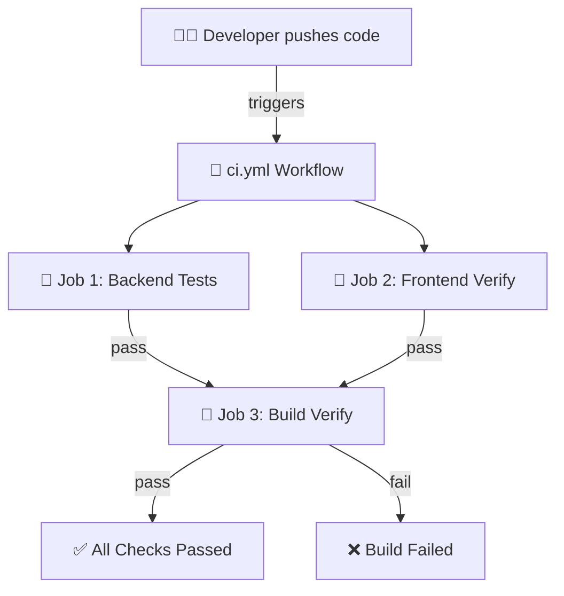
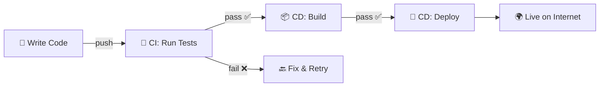
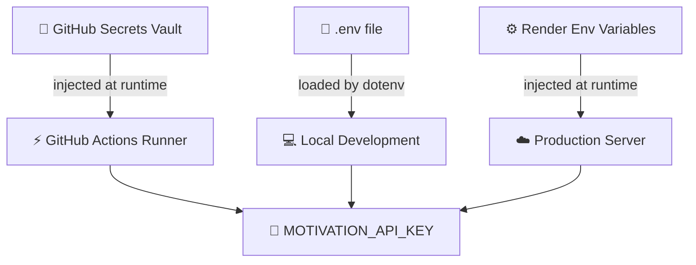
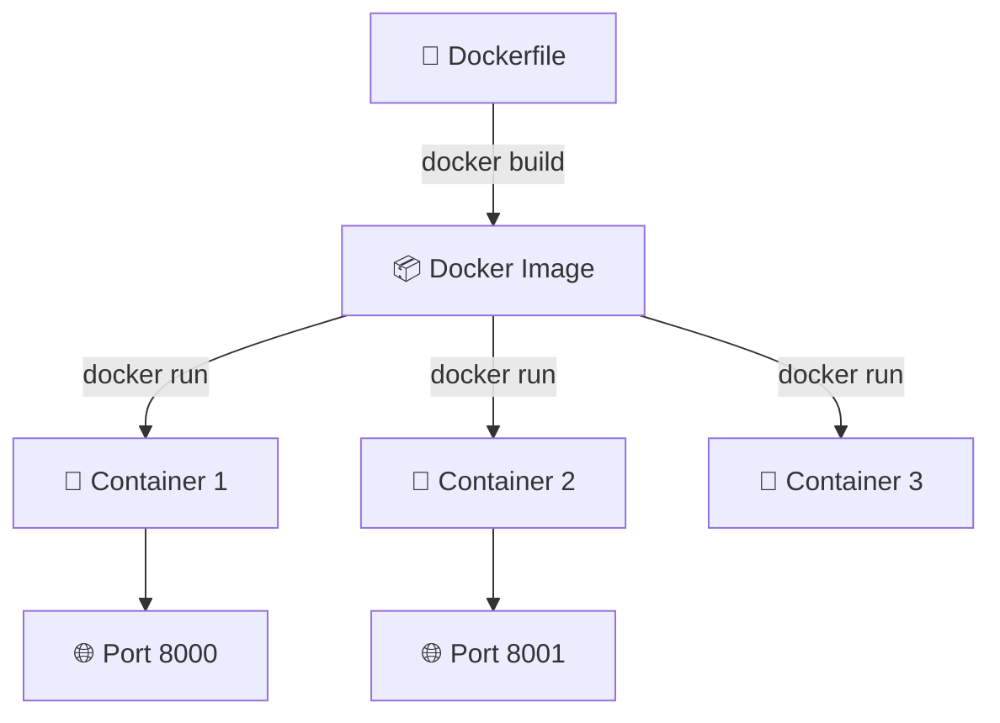
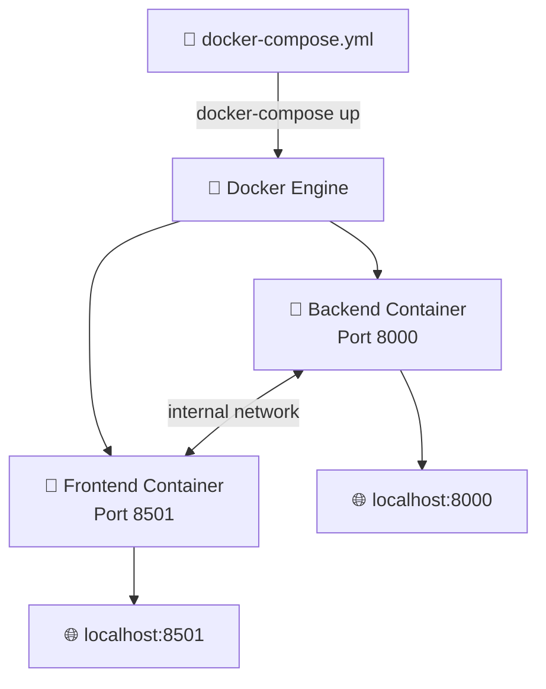
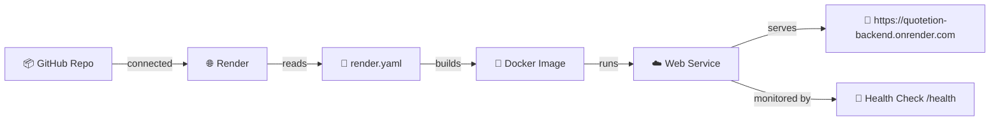
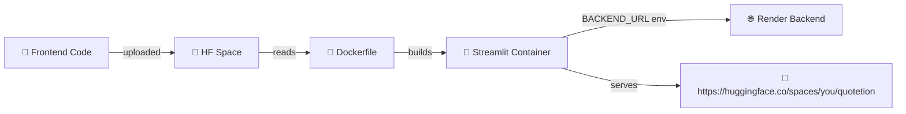
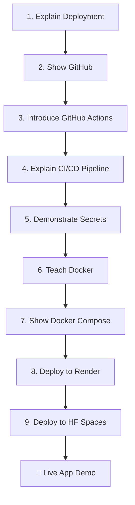

# 🎓 Teaching Guide — Quotetion

A comprehensive guide for teaching **9 DevOps and deployment concepts** using the Quotetion project. Designed for **2nd and 3rd year engineering students**.

---

## Table of Contents

1. [Deployment](#1-deployment)
2. [GitHub](#2-github)
3. [GitHub Actions](#3-github-actions)
4. [CI/CD](#4-cicd)
5. [GitHub Secrets](#5-github-secrets)
6. [Docker](#6-docker)
7. [Docker Compose](#7-docker-compose)
8. [Render](#8-render)
9. [Hugging Face Spaces](#9-hugging-face-spaces)

---

## 1. Deployment

### 🧒 Explain Like I'm 10

> "You know how you make a drawing at home? Deployment is like putting that drawing in a museum where everyone can see it. Your code is the drawing, and the internet is the museum."

### 🌍 Real-World Analogy

| Concept | Analogy |
|---------|---------|
| Your code on your laptop | A recipe written in your personal notebook |
| Deployment | Publishing that recipe in a cookbook available in every bookstore |
| Server | The bookstore shelf where your cookbook sits |
| URL | The address of the bookstore |

### 🏗️ Architecture Diagram

### ❓ Questions to Ask Students

| Question | Expected Answer |
|----------|----------------|
| "What happens when you run your app on localhost?" | "Only I can see it on my computer" |
| "What do we need to do so everyone can use our app?" | "Put it on a server on the internet — deploy it" |
| "What is a URL?" | "An address where people can find our app" |

### ⚠️ Common Misconceptions

- ❌ "Deployment means my app is done" → ✅ Deployment is a step in the lifecycle, not the end
- ❌ "I need my laptop running for the app to work" → ✅ Cloud servers run 24/7 independently
- ❌ "Deployment is a one-time thing" → ✅ You redeploy every time you update code

---

## 2. GitHub

### 🧒 Explain Like I'm 10

> "Imagine Google Docs, but for code. Multiple people can work on the same project, see who changed what, and go back in time if someone messes up."

### 🌍 Real-World Analogy

| Concept | Analogy |
|---------|---------|
| Repository | A shared Google Drive folder for your project |
| Commit | Pressing "Save" with a note about what you changed |
| Branch | Making a copy of a document to try changes without ruining the original |
| Pull Request | Asking your team to review your changes before merging |
| Clone | Downloading the entire folder to your computer |

### 🏗️ Architecture Diagram

### ❓ Questions to Ask Students

| Question | Expected Answer |
|----------|----------------|
| "Why don't we just email code to each other?" | "Git tracks changes, prevents conflicts, and keeps history" |
| "What's the difference between Git and GitHub?" | "Git is the tool, GitHub is the website that hosts Git repos" |
| "What happens if two people edit the same line?" | "A merge conflict — Git asks you to choose which version to keep" |

### ⚠️ Common Misconceptions

- ❌ "Git and GitHub are the same thing" → ✅ Git is the version control tool; GitHub is a hosting platform
- ❌ "I should commit everything at the end" → ✅ Commit often with small, meaningful changes
- ❌ "Delete a file means it's gone forever" → ✅ Git history preserves everything

---

## 3. GitHub Actions

### 🧒 Explain Like I'm 10

> "Imagine having a robot assistant that checks your homework every time you submit it. GitHub Actions is that robot — it automatically runs tests on your code whenever you push changes."

### 🌍 Real-World Analogy

| Concept | Analogy |
|---------|---------|
| Workflow | A to-do list for the robot |
| Trigger | "Do this whenever someone turns in homework" |
| Job | One big task on the to-do list |
| Step | A single instruction within a task |
| Runner | The computer the robot uses to do the work |
| Pass ✅ | Homework is correct |
| Fail ❌ | Homework has errors |

### 🏗️ Architecture Diagram

### ❓ Questions to Ask Students

| Question | Expected Answer |
|----------|----------------|
| "Where does the workflow file live?" | "In `.github/workflows/` directory" |
| "What language is the workflow file written in?" | "YAML" |
| "What triggers our workflow?" | "Push to main or a pull request targeting main" |
| "What happens if Job 1 fails?" | "Job 3 won't run because it depends on Job 1" |

### ⚠️ Common Misconceptions

- ❌ "GitHub Actions runs on my computer" → ✅ It runs on GitHub's cloud servers (runners)
- ❌ "I need to manually trigger it" → ✅ It triggers automatically based on events (push, PR)
- ❌ "If the workflow passes, my code has no bugs" → ✅ It only catches what the tests check for

---

## 4. CI/CD

### 🧒 Explain Like I'm 10

> "CI is like a spell-checker that runs automatically every time you write. CD is like auto-publishing your book to Amazon the moment the spell-checker says it's perfect."

### 🌍 Real-World Analogy

| Concept | Analogy |
|---------|---------|
| CI (Continuous Integration) | Automatic quality check at a factory assembly line |
| CD (Continuous Deployment) | Automatically shipping the product after it passes QC |
| Pipeline | The conveyor belt from code → test → deploy |
| Green build | Product passed quality control |
| Red build | Product rejected — go back and fix |

### 🏗️ Architecture Diagram

### ❓ Questions to Ask Students

| Question | Expected Answer |
|----------|----------------|
| "What does CI stand for?" | "Continuous Integration" |
| "What does CD stand for?" | "Continuous Delivery or Continuous Deployment" |
| "Why is CI/CD important?" | "Catches bugs early, deploys faster, reduces manual work" |
| "What would happen without CI/CD?" | "Manual testing, delayed releases, more bugs in production" |

### ⚠️ Common Misconceptions

- ❌ "CI and CD are the same thing" → ✅ CI = test/integrate, CD = deploy/deliver
- ❌ "CI/CD replaces all testing" → ✅ It automates testing, but you still need to write good tests
- ❌ "CI/CD is only for big companies" → ✅ Even solo developers benefit from automated testing

---

## 5. GitHub Secrets

### 🧒 Explain Like I'm 10

> "Imagine you have a diary with a lock. GitHub Secrets is like that lock — it keeps your passwords safe so nobody can read them, but your app can still use them."

### 🌍 Real-World Analogy

| Concept | Analogy |
|---------|---------|
| Secret | A password in a locked safe |
| Environment variable | A sticky note on your desk (but only you can see it) |
| `.env` file | A personal notebook with passwords (keep it private!) |
| Hardcoding a secret | Writing your password on a whiteboard for everyone to see 😱 |

### 🏗️ Architecture Diagram

### ❓ Questions to Ask Students

| Question | Expected Answer |
|----------|----------------|
| "Why can't we put API keys in our code?" | "Anyone who sees the code can steal and misuse the keys" |
| "Where do secrets come from in GitHub Actions?" | "From Settings → Secrets → injected as environment variables" |
| "Can you see a secret's value after saving it?" | "No — GitHub shows *** and never reveals it again" |
| "What's a `.env` file?" | "A local file that stores secrets for development — it's gitignored" |

### ⚠️ Common Misconceptions

- ❌ "Putting a secret in a private repo is safe enough" → ✅ Repos can be made public, forks exist, logs might leak
- ❌ "Secrets are only for passwords" → ✅ API keys, database URLs, tokens, and certificates too
- ❌ "If I delete a commit with a secret, it's gone" → ✅ Git history preserves it — you must rotate the secret

---

## 6. Docker

### 🧒 Explain Like I'm 10

> "Imagine a lunchbox. You put your food, plate, fork, and napkin all inside. No matter where you take it — school, park, or a friend's house — you have everything you need. Docker is a lunchbox for your code."

### 🌍 Real-World Analogy

| Concept | Analogy |
|---------|---------|
| Docker Image | A recipe + all the ingredients, packaged in a box |
| Docker Container | The actual meal being cooked from that box |
| Dockerfile | The recipe instructions |
| `docker build` | Preparing the meal kit |
| `docker run` | Cooking and serving the meal |
| Port mapping | Telling delivery drivers which door to bring food to |

### 🏗️ Architecture Diagram

### ❓ Questions to Ask Students

| Question | Expected Answer |
|----------|----------------|
| "What problem does Docker solve?" | "It works on my machine! Docker ensures it works everywhere." |
| "What's the difference between an image and a container?" | "Image is the blueprint, container is the running instance" |
| "Why do we COPY requirements first, then code?" | "Docker caches layers — if requirements don't change, it skips reinstalling" |
| "What does EXPOSE 8000 do?" | "Documents which port the container uses (doesn't actually open it)" |

### ⚠️ Common Misconceptions

- ❌ "Docker is a virtual machine" → ✅ Containers share the host OS kernel — much lighter than VMs
- ❌ "EXPOSE opens a port" → ✅ EXPOSE is documentation; `-p` in `docker run` opens ports
- ❌ "I need Docker for deployment" → ✅ It's optional but very helpful for consistency

---

## 7. Docker Compose

### 🧒 Explain Like I'm 10

> "If Docker is a lunchbox for one dish, Docker Compose is the whole meal plan — it organizes multiple lunchboxes (containers) and makes sure they're all served at the same table at the same time."

### 🌍 Real-World Analogy

| Concept | Analogy |
|---------|---------|
| Docker Compose | A restaurant kitchen manager |
| `docker-compose.yml` | The kitchen's menu and prep schedule |
| Services | Different kitchen stations (grill, salad, drinks) |
| `depends_on` | "Don't serve the main course before the appetizer" |
| Network | The intercom system between kitchen stations |

### 🏗️ Architecture Diagram

### ❓ Questions to Ask Students

| Question | Expected Answer |
|----------|----------------|
| "Why use Docker Compose instead of running containers manually?" | "One command starts everything, manages networking, and handles dependencies" |
| "How does the frontend find the backend?" | "Docker Compose creates a network — services find each other by name (e.g., `http://backend:8000`)" |
| "What does `depends_on` do?" | "Starts the backend before the frontend" |

### ⚠️ Common Misconceptions

- ❌ "Docker Compose is for production" → ✅ It's great for development; production often uses Kubernetes
- ❌ "`depends_on` waits for the service to be ready" → ✅ It only waits for the container to start, not for the app to be healthy
- ❌ "I need Docker Compose for single containers" → ✅ Use `docker run` for one container; Compose is for multi-container setups

---

## 8. Render

### 🧒 Explain Like I'm 10

> "Render is like a parking garage for your code. You drive your car (code) in, park it (deploy it), and anyone can come visit it using the address (URL). Render keeps the lights on 24/7."

### 🌍 Real-World Analogy

| Concept | Analogy |
|---------|---------|
| Render | A managed parking garage with valet service |
| Web Service | Your car parked and running |
| Deploy | Driving your car into the garage |
| Public URL | The garage's street address |
| Health Check | The valet checking if your car is still running |
| Environment Variables | Your car's settings (seat position, mirror angles) |

### 🏗️ Architecture Diagram

### ❓ Questions to Ask Students

| Question | Expected Answer |
|----------|----------------|
| "What is Render?" | "A cloud platform that hosts and runs your applications" |
| "How does Render know how to build our app?" | "It reads the `render.yaml` file and the Dockerfile" |
| "What is a health check?" | "An endpoint Render pings to make sure your app is alive" |
| "What happens when you push new code?" | "Render auto-deploys the new version" |

### ⚠️ Common Misconceptions

- ❌ "Free tier means unlimited" → ✅ Free tier has limits (spin-down after inactivity, limited hours)
- ❌ "Render hosts full-stack apps" → ✅ You typically deploy frontend and backend separately
- ❌ "Render.yaml is required" → ✅ You can also configure manually through the dashboard

---

## 9. Hugging Face Spaces

### 🧒 Explain Like I'm 10

> "Hugging Face Spaces is like a free art gallery where you can display your app for everyone to see. You bring your creation, they provide the gallery space and the visitors."

### 🌍 Real-World Analogy

| Concept | Analogy |
|---------|---------|
| Hugging Face | A community art gallery |
| Space | Your exhibition booth |
| SDK (Streamlit/Docker) | The type of display frame you choose |
| Environment Variables | Instructions you give the gallery staff |
| Public URL | The gallery's address + your booth number |

### 🏗️ Architecture Diagram

### ❓ Questions to Ask Students

| Question | Expected Answer |
|----------|----------------|
| "Why use HF Spaces for the frontend?" | "It's free, supports Streamlit natively, and gives a public URL" |
| "How does the frontend know where the backend is?" | "Through the BACKEND_URL environment variable set in Space Settings" |
| "Can we use HF Spaces for the backend too?" | "Technically yes, but Render is better for API backends" |

### ⚠️ Common Misconceptions

- ❌ "HF Spaces is only for AI/ML" → ✅ You can host any Streamlit, Gradio, or Docker app
- ❌ "I need a paid account" → ✅ Free tier is sufficient for most teaching projects
- ❌ "The frontend and backend must be on the same platform" → ✅ They communicate via HTTP — platform doesn't matter

---

## 📋 Teaching Flow Summary

Each topic builds on the previous one. Don't skip ahead!
